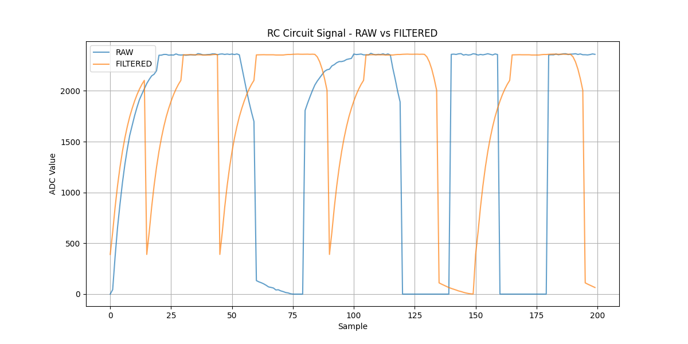
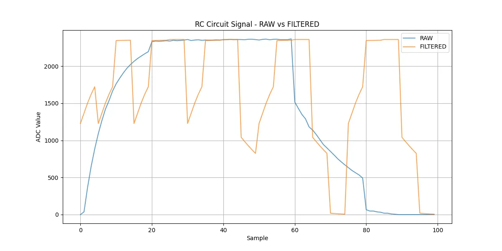
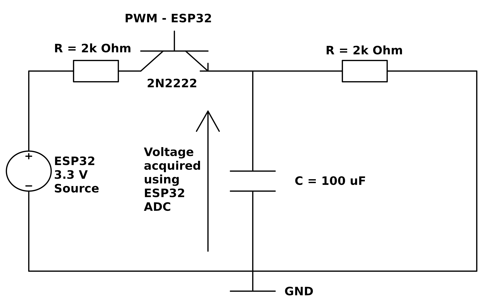

# ESP32 RC Circuit Signal Processing
 
This project demonstrates signal acquisition and processing of an RC circuit 
using ESP32's internal ADC, implemented in C++ with FreeRTOS. The system 
acquires analog voltage samples, applies a moving average filter, and logs 
both raw and filtered data for comparison. The architecture uses OOP principles 
with a class hierarchy for signal acquisition, filtering, and logging.

## Overview

This project is written in C++ and built for ESP32 family of embedded systems.
The environment used to create it was ESP-IDF which is an integrated development framework
for IoT/microcontrollers which is using Python for its core. The idea is to capture an analog
signal using ESP32, filter it using average filter method and log the outcome. 

Data flow in system:
```
┌─────────────────────────────────────────────────────────┐
│                     Data Flow                           │
│                                                         │
│  RC Circuit                                             │
│  Voltage ──► ADC (GPIO32) ──► RCSignal::acquire()       │
│                                │                        │
│                                ▼                        │
│                       std::vector<float>                │
│                         (raw samples)                   │
│                                │                        │
│                    ┌───────────┴───────────┐            │
│                    │                       │            │
│                    ▼                       ▼            │
│             Logger::log()         Filter::process()     │
│            [RAW] output          moving average (N=10)  │
│                                           │             │
│                                           ▼             │
│                                    Logger::log()        │
│                                  [FILTERED] output      │
│                                           │             │
│                                           ▼             │
│                                       ESP_LOGI          │
└─────────────────────────────────────────────────────────┘
```
Plots showing implemented filter which is a moving average type and two different N:



We can see a RAW and FILTERED data that correspond to real RC circuit behavior in a changing state.



It is noticeable that higher N results in bad behaviour of said filter.
This is a great demonstration that moving average isn't always a good thing — a window that's too large
distorts the signal instead of smoothing it. This is the DSP trade-off.

The simple moving average filter applied to ADC measurements acts as a low-pass FIR filter, 
smoothing high-frequency noise while preserving the underlying trend of the RC signal. 
The filtered waveform shows reduced variance compared to the raw data, consistent with theoretical 
expectations for a finite-impulse response smoothing filter.

## Hardware

The code for this repository was tested on real hardware which was ESP32-DevKitC and 
the example analog source for acquisition was chosen to be a RC charging/discharging 
circuit controlled with PWM signal from ESP32 with 2N2222 BJT transistor.

Electrical circuit diagram:



Circuit and its connections used in testing:

```
3.3V
 │
 R (2kΩ)
 │                          
 C ──── B (2kΩ) ──── GPIO26   (BJT 2N2222 Connection)
 │
 E
 │
 ├──────────────────── GPIO32 (ADC)
 │
 ├──── R (2kΩ) ──── GND
 │
 ├──── C (100uF) ── GND
```

## Software

The software written in C++ is using classes and inheritance as well as FreeRTOS tasks
in order to process the data acquired in a simple manner. Implementation of FreeRTOS
allowed to create two tasks that are working side by side handling PWM signal to transistor and handling of Data.

Classes:
- Signal (base class) — abstract interface
- RCSignal : Signal — ADC acquisition
- Filter — moving average processing  
- Logger — data output via ESP_LOGI

Software architecture:

```
┌─────────────────┐         ┌─────────────────┐
│   PWM_Handler   │         │   Data_Handler  │
│   (FreeRTOS)    │         │   (FreeRTOS)    │
│                 │         │                 │
│  GPIO26 toggle  │         │  RCSignal       │
│  HIGH/LOW       │         │  └─ acquire()   │
└────────┬────────┘         │  Filter         │
         │                  │  └─ process()   │
         │ charges/         │  Logger         │
         │ discharges       │  └─ log()       │
         ▼                  └────────┬────────┘
    RC Circuit                       │
                                     ▼
                                 ESP_LOGI
                              [RAW] & [FILTERED]
```

## How to build

Building a repository needs ESP-IDF environment and is available for free on ESP-IDF website.
The commands used in order to compile and flash the repository on ESP hardware. 

```bash
idf.py build
idf.py flash monitor
```

## Requirements
- ESP-IDF v5.x
- ESP32 DevKitC / or any other ESP32 compatible device see ESP32 documentation for more info.
- RC circuit/Microphone or any other analog voltage source supported by ESP32 ADC. (Refer to your board documentation)

## References
- [ESP-IDF Documentation](https://docs.espressif.com/projects/esp-idf/en/stable/esp32/)
- [FreeRTOS Documentation](https://www.freertos.org/Documentation/RTOS_book.html) 
